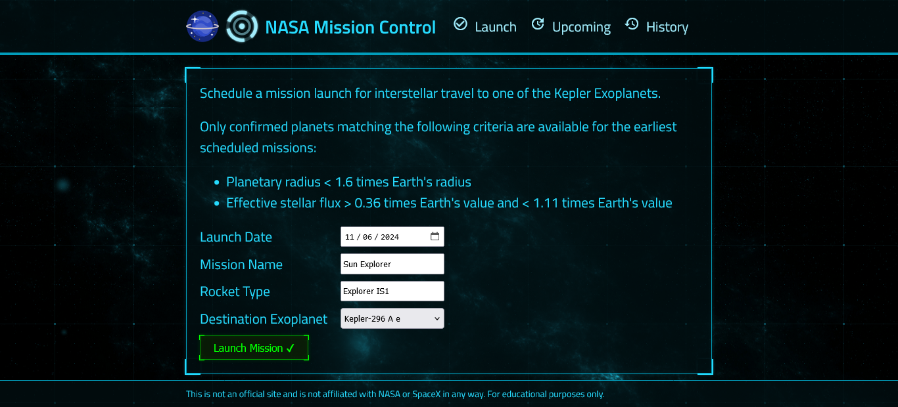
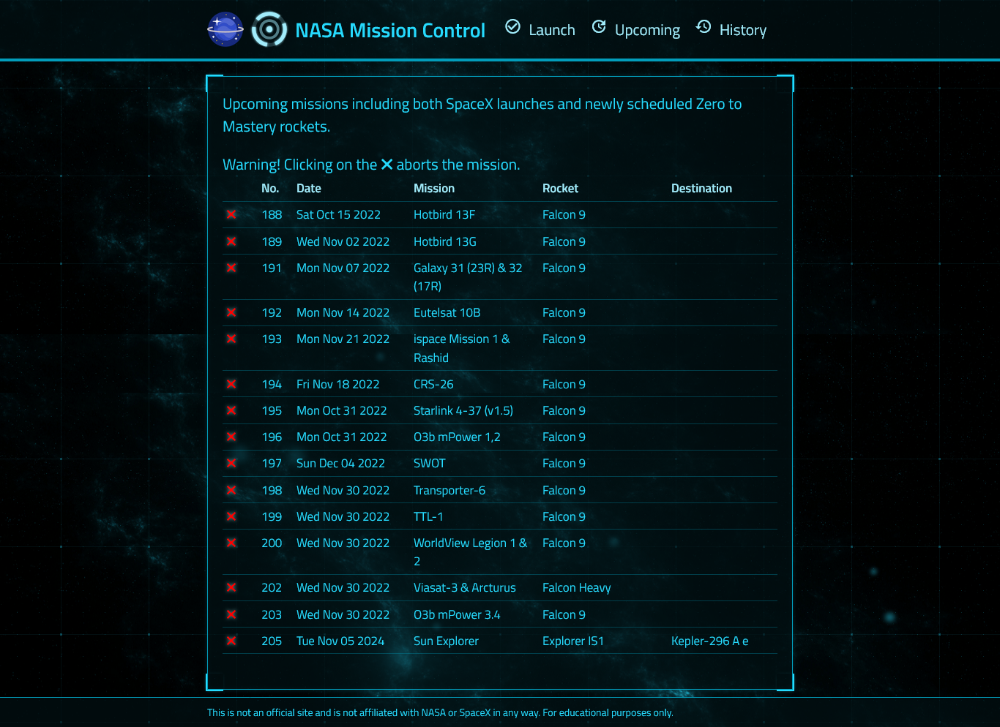
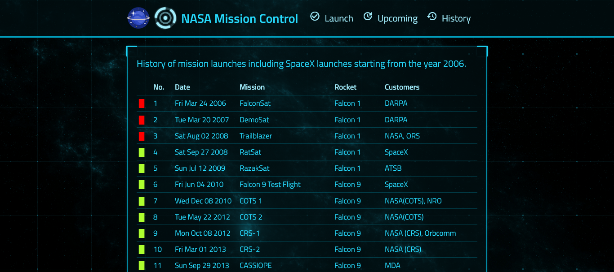

<h1>NASA Mission Control Project :earth_americas:</h1>

NASA Mission Control is a fullstack web application designed to manage space missions. This project enables users to schedule new launches, delete existing launches, and review the history of all launches.

<h2>Overview</h2>

- Frontend: Built with ReactJS to create a dynamic and responsive user interface.

- Backend: Developed using NodeJS to handle server-side logic and API requests.

- Database: Utilizes MongoDB to store and manage launch data.

- Containerization: Docker is used to create an image and deploy the application as an active live link.

<h2>Key Features</h2>

- Launch Management: Schedule new space launches seamlessly.
- Launch Deletion: Remove scheduled launches with ease.

- Launch History: Access a detailed history of all past launches.

<h2>Getting Started</h2>

1. Ensure you have NodeJS installed.
2. Create a free Mongo Atlas database online or start a local MongoDB database.
3. Create a `server/.env` file with a `MONGO_URL` property set to your MongoDB connection string.
4. In the terminal, run: `npm install`

<h2>Running the Project</h2>

1. In the terminal, run: `npm run deploy`
2. Browse to the mission control frontend at localhost:8000 and schedule an interstellar launch!

<h2>Docker</h2>

1. Ensure you have the latest version of Docker installed.
2. Run `docker build -t nasa-project`
3. Run `docker run -it -p 8000:8000 nasa-project`

<h2>Running the Tests</h2>

To run any automated tests, run `npm test`. This will:

- Run all the client-side tests: `npm test --prefix client`
- Run all the server-side tests: `npm test --prefix server`

### Link

- Live Site: [NASA Mission Control](https://nasa-project-8xvh.onrender.com/)

### Screenshots

